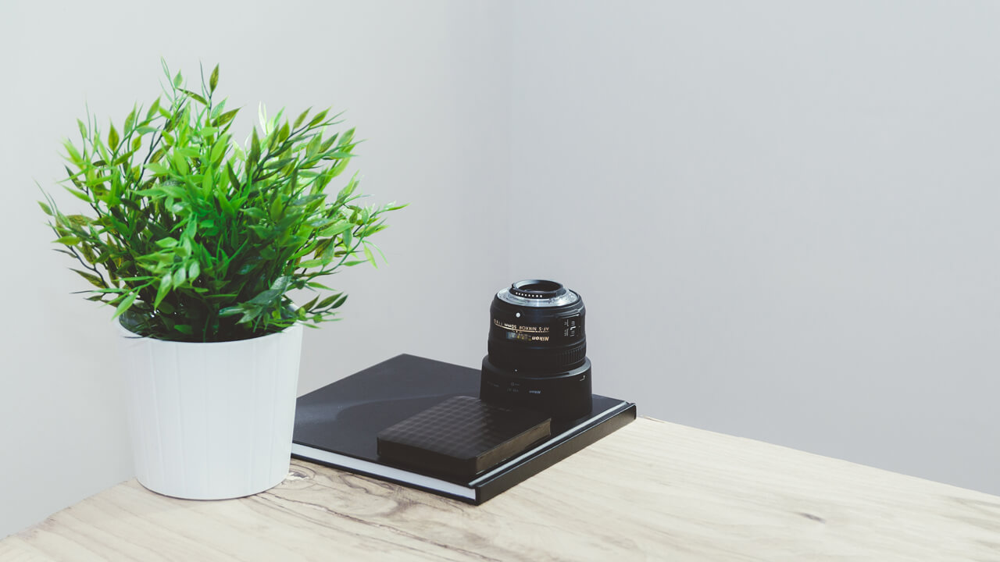
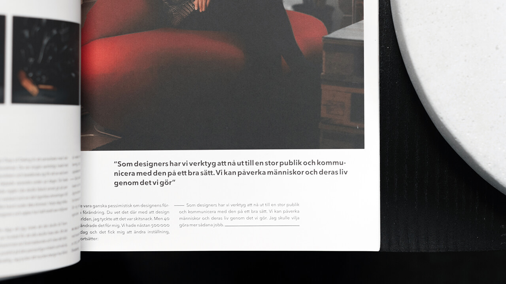

{::nomarkdown}

{:/}

<!-- 

This particular page should contain formalities, messages for your reader(s), links along with downloads for your live CV, NLT document and previous portfolio to highlight improvements. You should also include a section with work that may not fit into a particular section, but you'd like to show off anyway. This, or a section of this on each page. I.e. "unused web projects" or "photos that didn't make the cut".

* Mention the year briefly
* Link to the previous portfolio, mention why you're doing X, Y and Z
* Highlight improvements
* Ramble, mention work placement and link to updated NLT
* Sidenote, link to live CV
* Have a dedicated section to unused/unfinished projects, but limit to screenshots -->

First and foremost, thank you for reading my portfolio. I appreciate it. Secondly, while I adapt products to client needs, requirements and wishes, my personal style is very much influenced by Scandinavian design and outstanding individuals like Erik Spiekermann, Dieter Rams and Andrew Kim.

They, along with great magazines like Offscreen and Monocle, inspire me, and while I may not be anywhere near their level of perfection just yet, they encourage me to work hard.

## Preface

	As a preface to this semester, I'd like to mention my <a href="http://magnusskare.science/uni/" target="_blank">previous portfolio</a>. While I believe it did manage to showcase my work in a professional manner, I have to agree with the feedback I received &mdash; it was impenetrable. The sheer volume of work came across as overwhelming, mainly due to my subjective fear of seeming shallow. I wanted to show depth, but completely disregarded the end user (you) in the process.
	For reference: the <a href="http://magnusskare.science/uni/" target="_blank">previous portfolio</a>, hosted on a seperate web server

I hope to include a vast amount of work this year as well, but hopefully keep brevity in mind this time. I'd also like to clarify that I can not show every single project from my work placement, due to contracts and work agreements.

Download my <a href="#">NLT document</a> and <a target="_blank" href="../img/formalities/cv.pdf">live CV</a>.

And please <a href="https://github.com/partcoffee/uni" target="_blank">explore the GitHub repository</a> behind this website as well, as it is a key part of what I am submitting. This accompanies the <a href="/portfolio">portfolio case study</a> and is mainly referring to the comments in the <a href="https://github.com/partcoffee/uni/tree/master/_sass" target="_blank">Sass folder</a>, <a href="https://github.com/partcoffee/uni/tree/master/css" target="_blank">main Sass file</a> and <a href="https://github.com/partcoffee/uni/blob/master/js/main.js" target="_blank">main JavaScript file</a>.

## Juggling work and university

I am extremely grateful for the opportunity given to me by the University of Winchester and my current workplace, letting me work full-time alongside my studies. It has been stressful, certainly, but the amount of knowledge I have acquired through this arrangement would have taken me significantly longer to gather on my own from inside my comfort zone.

To clarify, I have been working for Riktig Spor as of September 1st, and tuning into lectures over Skype on a weekly basis. This has given me weekends and afternoons to work on university projects. This is admittedly less time than last year, as I had dedicated days to university work, rather than hours. However, I would argue that with less time spent in lectures, fewer deadlines on a week-by-week basis, and a neglectable amount of group work, I should have enough time to focus on my individual work and deadlines.

{::nomarkdown}

{:/}

## What I hope to improve upon

<ul class="skill-list">
	<li>Client management</li>
	<li>Content management systems</li>
	<li>Web development</li>
	<li>Build systems</li>
	<li>Design critiques</li>
	<li>Photography</li>
	<li>Project management</li>
	<li>Business strategies and cost estimates</li>
</ul>

## Secondary work

I also have a fair amount of unfinished or unrelated (to the university) projects. I simply ran out of time to do other projects this year, but I have included bits and pieces anyway. They may not be as polished or well thought out as everything else, but I have included them <a href="/secondary">in this portfolio</a> to emphasise their existence anyway.

## Acknowledgements

I would also like to emphasise my deepest gratitude for the help and support throughout this semester.

**Brita Bjørnbakk**, for her trust and investment in me as a student and developer.

**Debs Wilson and Paul Wilson**, for their continued trust, support, belief in my abilities and time spent helping me.

**University of Winchester staff**, for their help to make this semester possible to complete from abroad.

**Riktig Spor**, for their continued support, encouraging words and flexibility when it comes to my time spent studying.

