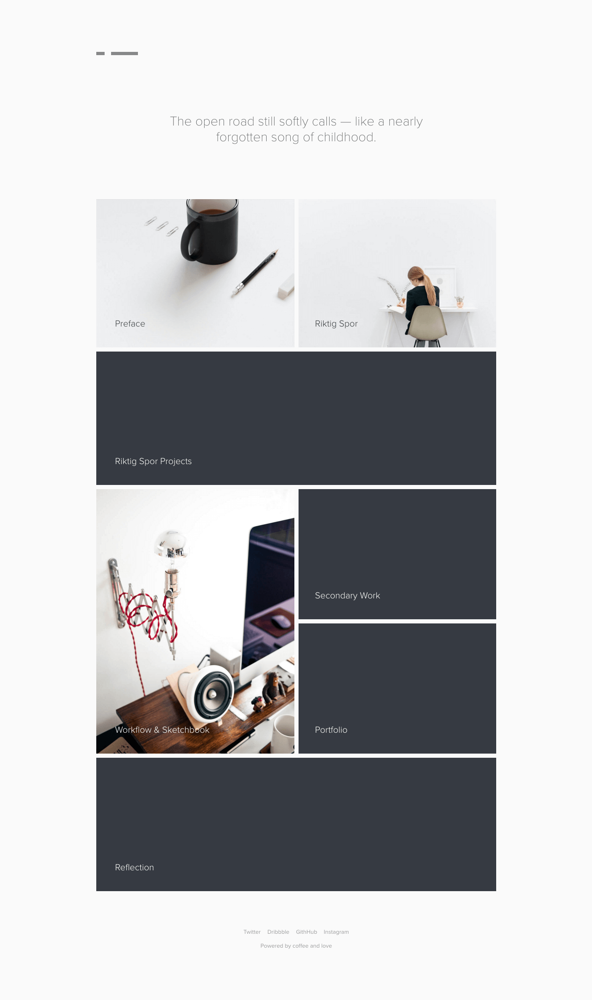

{::nomarkdown}

{:/}

<a href="http://magnusskare.science/uni-website/" target="_blank">Last semester</a> I thought I had a love&ndash;hate relationship with designing things for myself. This semester, I can confirm it. However, I also learned about the importance of "good enough" and releasing a minimum viable product (MVP) &mdash; and adding additional features of lesser importance later.In product development, the MVP is the product with the highest return on investment versus risk.

I should mention the feedback from my previous two years in order to justify where we stand. My <a href="https://magnuss.carbonmade.com/" target="_blank">first university portfolio</a> was too brief, with lacking depth. Beautiful outcomes, but lacking a solid foundation. Justified critique and I agree with it.

My <a href="http://magnusskare.science/uni/" target="_blank">second university portfolio</a> took this into a count, but perhaps too much. I believe the exact feedback was "excellent, but impenetrable". Once again, justified, and my fear of seeming too shallow with my work disregarded the end user completely &mdash; and while it did not affect my final mark much, I hope to keep this in mind this time. Brevity counts!

{::nomarkdown}

{:/}

## Problem & solution

Once again, a portfolio may come across as disjointed when you present a wider range of styles throughout your work. Therefore, I still aim to present a rather blank canvas to work on as a primary solution to this, giving every project the attention it deserves. You should see the <a href="/workflow-and-sketchbook">workflow & sketchbook</a>-section if you're interested in how I work, solve problems and essentially get from A to B.

Echoing my statement from last year, let's move on to typography: "I figured my content would benefit from having its own page — carefully dedicating space to each individual project. This should add a sense of depth to every project. The design went through an organic process, starting with the most important aspect; typography."

{::nomarkdown}

{:/}

## User-focused typography

We source our typography from <a href="http://typekit.com" target="_blank">Typekit</a>, using different weights of Proxima Nova to satisfy our needs. It's a popular typeface, ideal for multiple purposes like headings and paragraphs &mdash; depending on your font-weight. Proxima Nova is clean, neautral and fit for a purpose where the work should be the main focus.

The site sticks to roughly 60-80 characters per line, offering a comfortable reading experience on most modern devices. I also found it important to not disable zoom or any other default behaviour, should my assumptions on reading experience be incorrect.

{::nomarkdown}

{:/}

## Speed & performance

I care about speed and performance. In fact, I am writing my dissertation on performance and accessibility. That's why I built this site with Jekyll to avoid database requests completely.Jekyll is a static site generator, and will by nature be faster than PHP-based solutions

Jekyll is a static site generator and will serve static HTML-files for the end user. The site is generated locally, so we can still benefit from PHP-like includes on our footer and header &mdash; this will let us avoid the pain of writing static HTML over and over again. It also makes updates a breeze.

Everything else goes without saying, but should mentioned anyway: asset compression (JS, CSS, HTML), image compression, limit HTTP requests and third party resources. This should leave us within a reasonable performance-budget of 2 second load time on our initial request.

{::nomarkdown}

{:/}

## Maintainability & technology

Without getting too technical, I can mention that the site is not very client-friendly. <a href="http://jekyllrb.com/" target="_blank">Jekyll</a> in itself runs on Ruby, which is installed via Node and NPM. That's already a bit too much for most clients.View the code behind this site on <a href="https://github.com/partcoffee/uni" target="_blank">GitHub</a>

However, this is not a client website, and the lack of a content management system gives me more control as a developer. All my content is written in Markdown, which is a simple and easy-to-grasp language and saves you hours of work in the long run, compared to writing HTML-tags for everything. The <a href="https://daringfireball.net/projects/markdown/syntax" target="_blank">documentation</a> gives a thorough overview of what the language is about.

I have made my life easier by listing projects in a json-format in a data-folder though. A loop runs through the data to create the project listing on the homepage. I still code in <a href="http://sass-lang.com/" target="_blank">Sass</a> to benefit from variables and functions in CSS, but I moved on to <a href="http://gulpjs.com/" target="_blank">Gulp</a> to speed up my workflow. However, GitHub Pages will only support a naked Jekyll build with no plugins or third party build tools, and thus this site might have been generated with the default Jekyll ruby generator.

I have made the source-code available on GitHub, which should show the raw files I work with. This should also show the progression from A to B through my <a href="https://github.com/partcoffee/uni/commits/master" target="_blank">commit history</a>.

You can also see how the code works in the <a href="https://github.com/partcoffee/uni/blob/master/css/main.scss" target="_blank">main SCSS-file</a>, which extends to all the <a href="https://github.com/partcoffee/uni/tree/master/_sass" target="_blank">included scss-files</a> and <a href="https://github.com/partcoffee/uni/blob/master/js/main.js" target="_blank">main JavaScript file</a>. If you are a developer, I strongly encourage you to clone to repo or read through it on GitHub as everything is commented to satisfy the assessment sheet.

## Alternative approach

This site certainly not the plan all along, and I did have several different approaches in mind. I have been experimenting with cover-pages, one-page layouts and similar design propositions to this one. However, subjectively and based on colleague feedback, this seemed to be the best approach to highlight all my work in a structured and efficient way. The blank canvas should give each project the attention it deserves, while simutanously giving me the freedom to be as brief or as thorough as appropriate.The <a href="/workflow-and-sketchbook">workflow & sketchbook</a>-section highlights how I work

I have included some different approaches as screenshots, but live examples are available upon request. I also have a couple of more screenshots from my process under <a href="/secondary">secondary work</a>. These are all fully responsive and should function well in all modern browsers &mdash; but that's a given these days.

{::nomarkdown}

<!--  -->
<!--  -->
{:/}

## Reflection & conclusion

I hopefully improved upon the <a href="http://magnusskare.science/uni/" target="_blank">previous university portfolio</a> by keeping user experience in mind from the very beginning. By developing a dedicated site for my university projects, I could tailor the site to a very specific group of people &mdash; and as I know who these users are, and I'm aware of their feedback from previous projects, it was easy to aim for shorter and richer articles.

I hope this site is able to reflect the amount of work and effort I have put into this semester. Because I really do believe I have the results to prove it.

