{::nomarkdown}
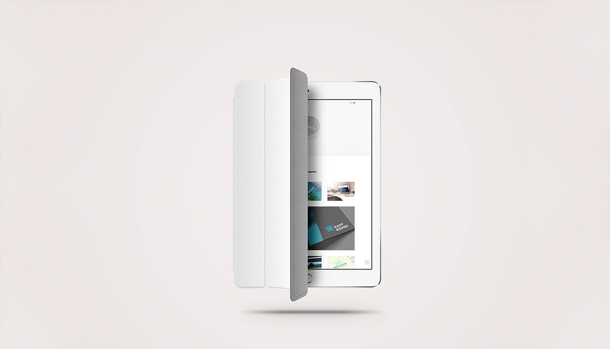
{:/}

## Riktig Spor

This was my first real-world project for Riktig Spor, and involved web development, web design, web performance and web accessibility. Our goal was to decrease our initial load-time, translate premade content to Norwegian, and offer a better user experience.Visit the live site at <a href="http://riktigspor.no" target="_blank">riktigspor.no</a>

Web performance was achieved through asset-compression and fewer HTTP-requests. We also removed some animations and shortened their duration to give the illusion of a snappier website. Everything else involved cleaning up existing PHP-files and adding features. Finally, I moved the site from a staging-server to a live server, which we released mid-October.

We also wanted to update our company-pictures, which I made an attempt at. I am happy with <a href="http://riktigspor.no/om-oss/" target="_blank">the pictures</a>, but I do wish to re-shoot some of them &mdash; for the sake of quality and consistency.

This first project introduced me to a lovely team, how they collaborate, and what expecations I should meet in order to be effective and valuable.

You can find the <a href="http://riktigspor.no" target="_blank">live site here</a>.

{::nomarkdown}
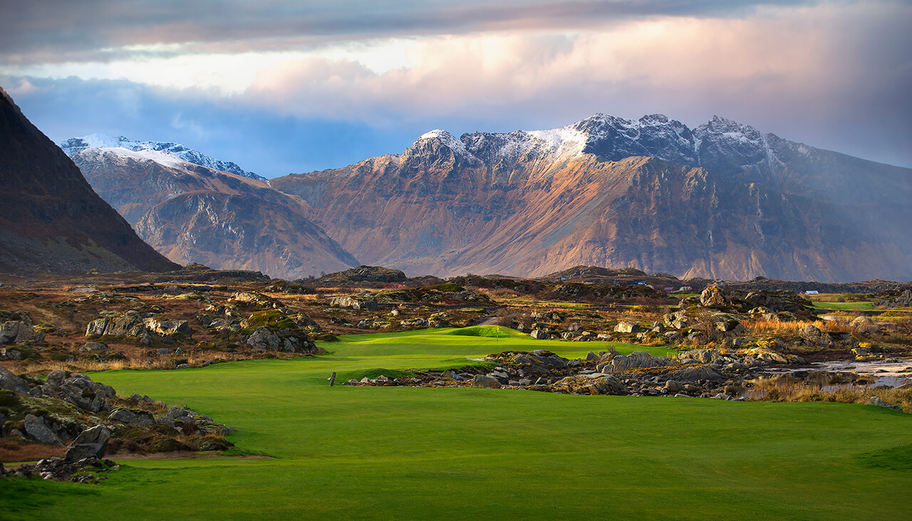
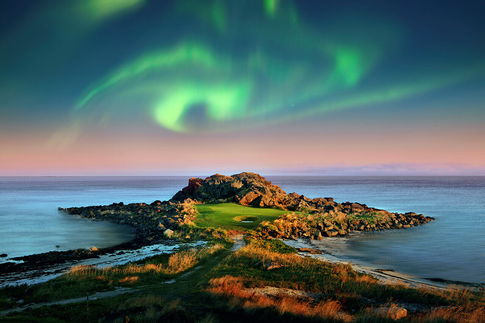
{:/}

## Lofoten Links

Lofoten Links is the world's most northern golf course. My company developed a new brand identity along with a new website. The website was largely finished when I started, but I took on the job of cleaning up some code, as well as adding new custom features to the site itself.Visit the live site at <a href="http://lofotenlinks.no" target="_blank">lofotenlinks.no</a>

The project was inspired by the local landscape with the aim to become the greatest golf course in the world.

From this I learned how we work with established client-websites. At this point I am working on live sites, but I will eventually move on to local development &mdash; which is recommended, encouraged and preferred.

You can see the <a href="http://lofotenlinks.no/" target="_blank">live website here</a>.

	

		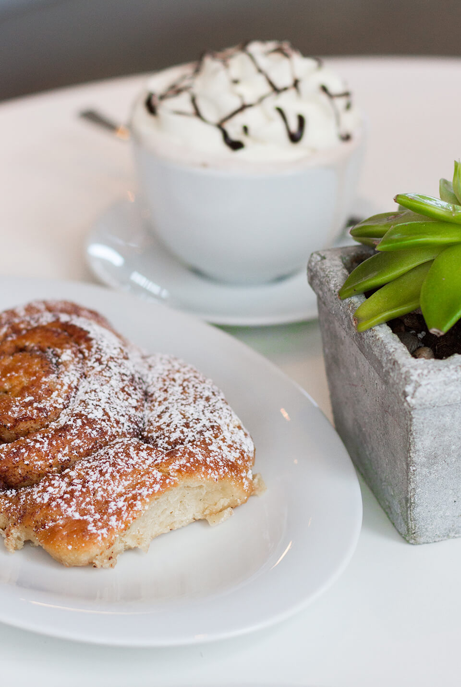
	

	

		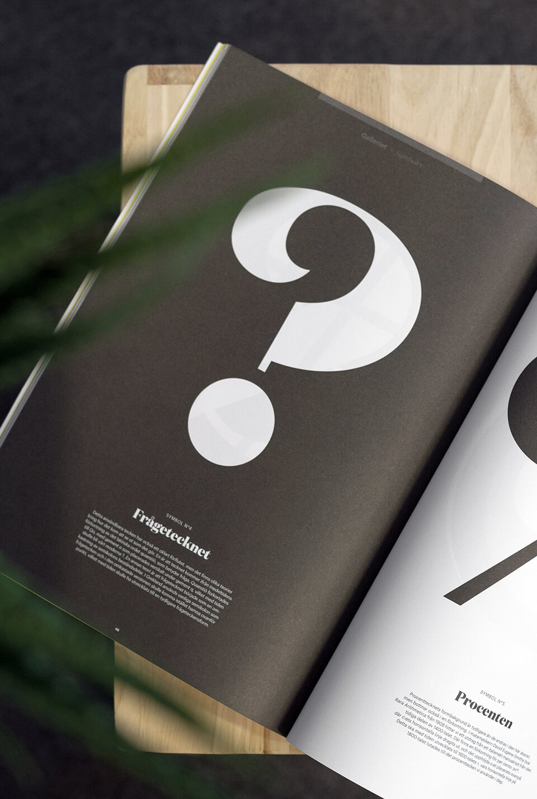
	

	

		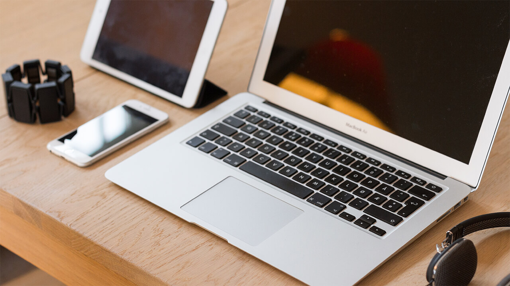
	

## Instagram

For a week I took care of the company's Instagram-account to see what a more active social media account would do for us. I shot a fair amount of pictures, but stuck to one picture a day for one week &mdash; with some additional activity the following weeks.I posted to the <a href="http://riktigspor.no/" target="_blank">Riktig Spor</a> Instagram account

From this I experienced the use of analytics, sponsored Instagram posts and how online activity affected our growth. We should ideally be posting at least two times a week, and it might be something I will pick up on when my days are less busy.

{::nomarkdown}
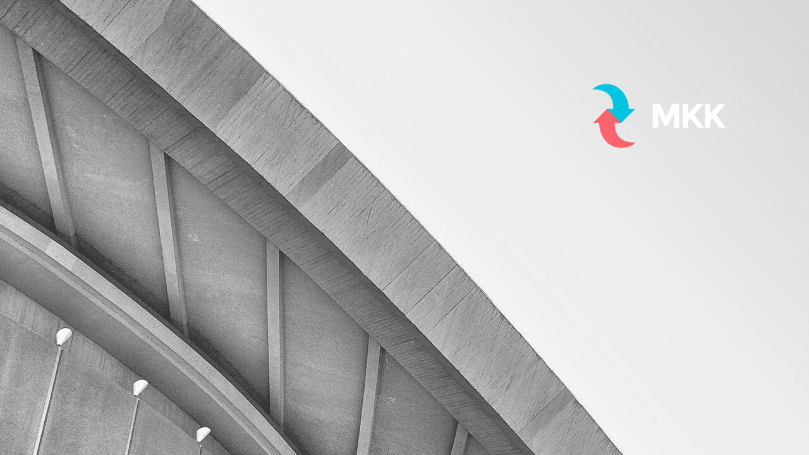
{:/}

## MKK

Mosjøen Kulde &amp; Klimaservice (MKK) is a Northern Norway-based company delivering heating and cooling units to the world. My responsibility for this particular project covered client management, web development, design, server- and domain-configurations, content management system tutoring and delivery.Visit the live site at <a href="http://mkk.ac" target="_blank">mkk.ac</a>

The site was developed for Wordpress, giving the client complete control over every aspect of the site post-launch. Along the way I also developed a contract for the client(s) to sign as we finish the website, leaving them responsible for future updates to the content management system. The client also requested a logo update to make it more modern, yet keeping the existing shapes and colours.

From this I gained hands-on experience with the company's routine and how they interact with clients from start to finish. They trusted me to do a good job, leaving most of the work to me without the need for a supervisor. I also had the opportunity to further develop my web development and server management skills, along with brand guidelines and vector graphics.

You can see the <a href="http://mkk.acc/" target="_blank">live website here</a>.

{::nomarkdown}
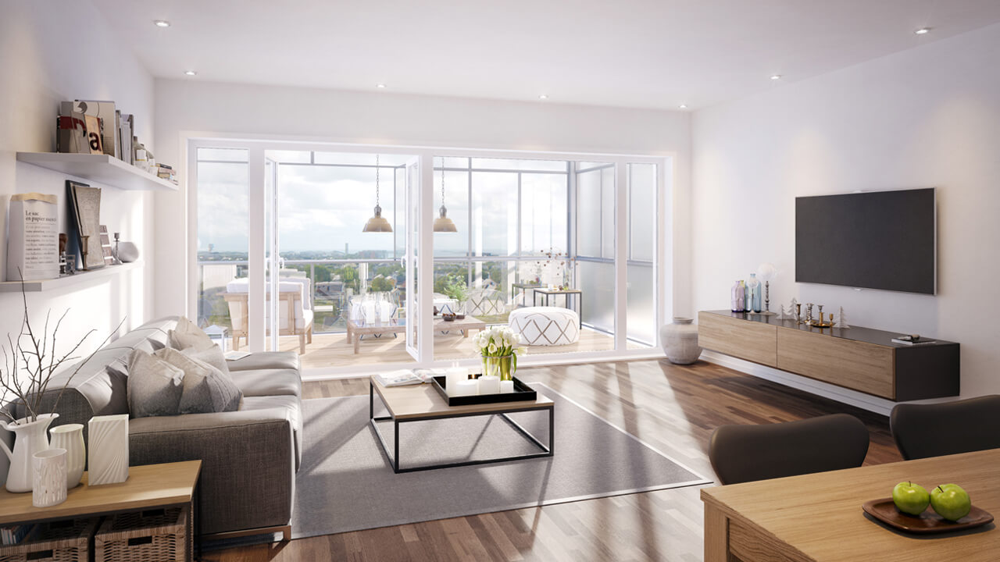
{:/}

## Bryggerikvartalet

Bryggerikvartalet is building new luxury apartments in Bodø, focusing on high-end buildings and a higher standard of living. My responsibility for this particular project involved the building and designing of the website along with content curation.Visit the live site at <a href="http://bryggerikvartalet.no" target="_blank">bryggerikvartalet.no</a>

I gained even more experience with clients, expected behaviour and working to tight deadlines. I also worked from critiques and changing minds along the way, which forced me to pay additional attention to time management.

You can visit the <a href="http://bryggerikvartalet.no/" target="_blank">live website here</a>.

{::nomarkdown}
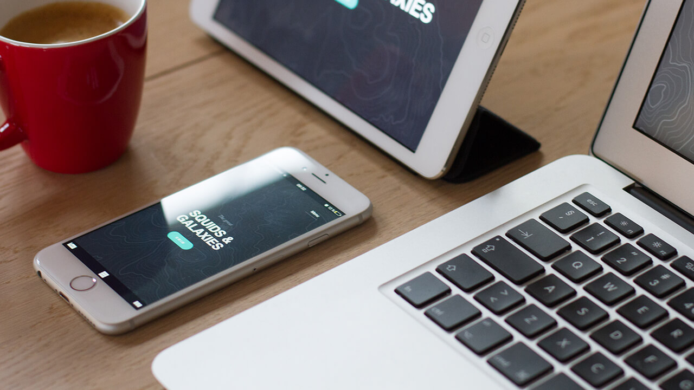
{:/}

## In-house development

This is a hard-coded Wordpress theme, made from scratch with modern browsers in mind. My intention for this particular project was to lay a solid foundation for in-house development over theme-customization. Not only does this give us more control as everything can be adjusted to client needs, but it is also lighter and faster for the end-user.We built <a href="http://glea.no" target="_blank">Glea</a> using this theme

Without getting too technical, the site is built with Gulp to handle assets, jQuery as our JavaScript library of choice and Advanced Custom Fields for complex and editable content for the client. The site is based on flexbox for layouts, which is arguably cutting-edge technology, but also arguably mandatory to phase out old browsers.

My responsibilities for this project covered the building and designing of the theme, selection of plugins used, contract development and client counseling.

{::nomarkdown}
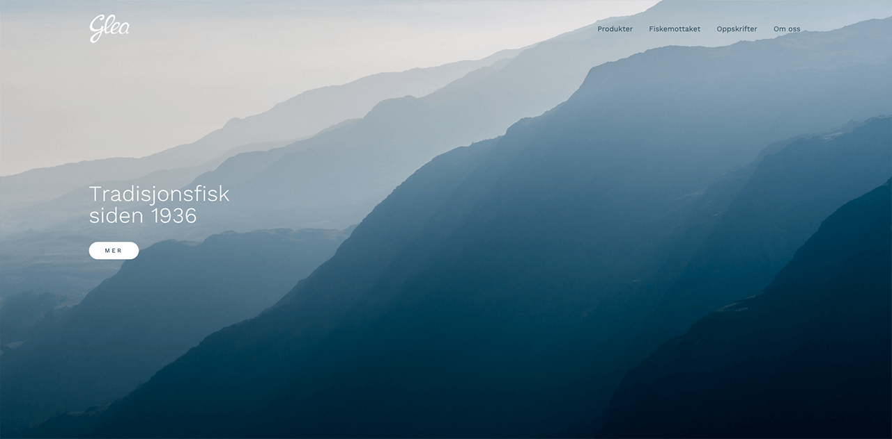
{:/}

## Glea

Glea delivers a range of sea-food to the world, including Italy and Norway. My task for this project was to manage the client, the development of their new website, the setup a new hosting provider and site-launch.

This was the first project where I had complete control over the development-phase, which means I could offer a SEO-friendly and <a href="http://www.webpagetest.org/result/151118_H0_NF5/" target="_blank">performant</a> website for all modern browsers.

Explore the <a href="http://glea.no" target="_blank">live site</a>.

{::nomarkdown}
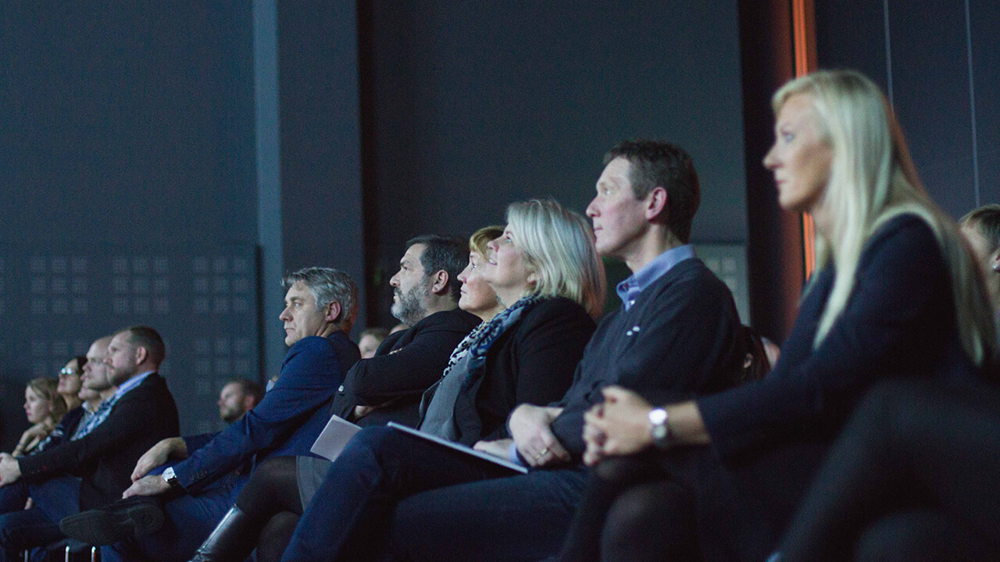
{:/}

## Bodø I Vinden

Bodø I Vinden aims to promote and expand Bodø as a town, making it more attractive to visit, live in and experience. I was a part of the launch event as a photographer and a part of the website, as a web developer, designer and content curator.Watch the <a href="https://www.youtube.com/watch?v=cARSXMCZ9Z8" target="_blank">launch event film</a> and the <a href="http://www.bodo.no/" target="_blank">new website</a>.

From this I learned how to promote events through social media, adapt website themes to customer needs and teach non-tech people how to use content management systems.

The project launched November 26th with a <a href="https://www.youtube.com/watch?v=cARSXMCZ9Z8" target="_blank">new film</a>, <a href="http://www.bodo.no/" target="_blank">new website</a> and interesting talks from speakers from all over the country.

<!-- {::nomarkdown}
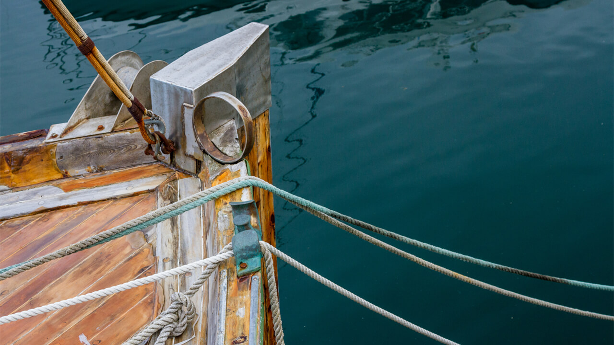
{:/}

## Bodø Havn

Bodø Havn (Bodø Port) is our local port, and they are currently working on a new website. This is a rather large project with a fair amount of complex features.

The building of the site is being outsourced and my role for this project primarily covers business advice and technical advice – explaining the complexity or simplicity of features requested.

The site may or may not be live as you are reading this. -->

	

		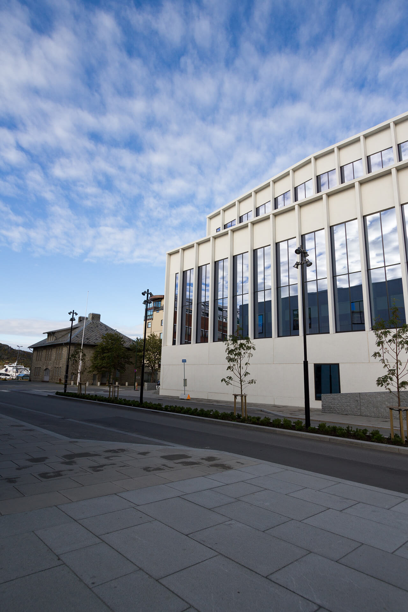
	

	

		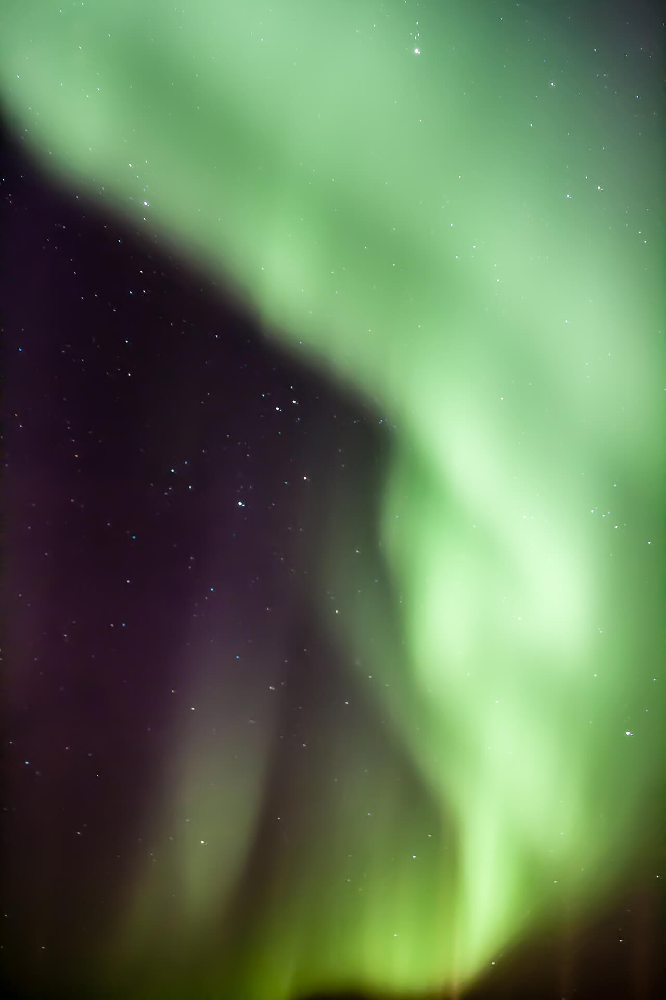
	

	

		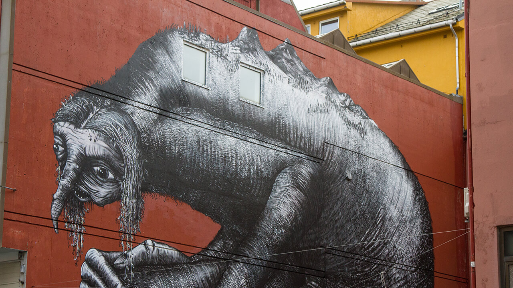
	

## Bodø 2016 and general photography

I also shot some pictures for Bodø 2016, which is essentially celebrating the town's 200th birthday! That's the first three pictures. The following pictures are bits and pieces from other projects, internal and external:

	

		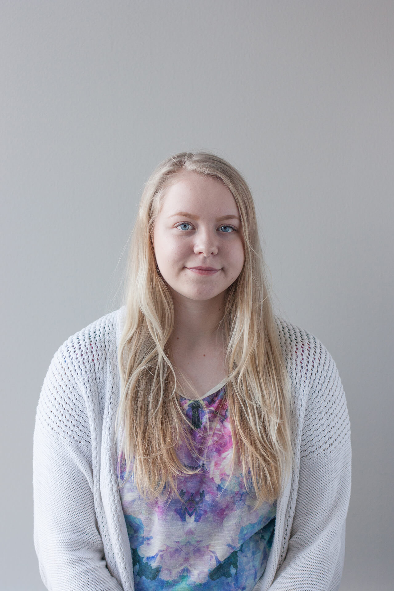
	

	

		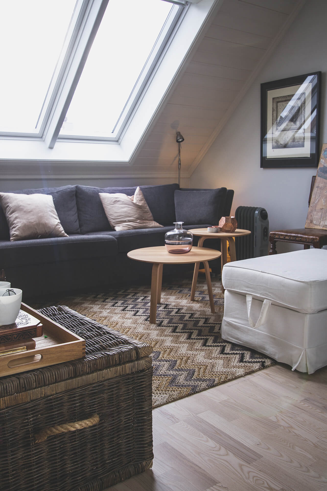
	

	

		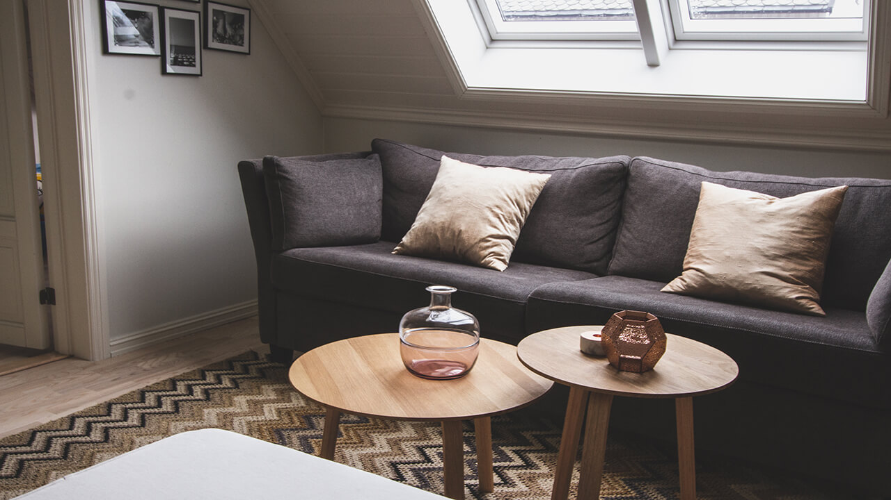
	

	

