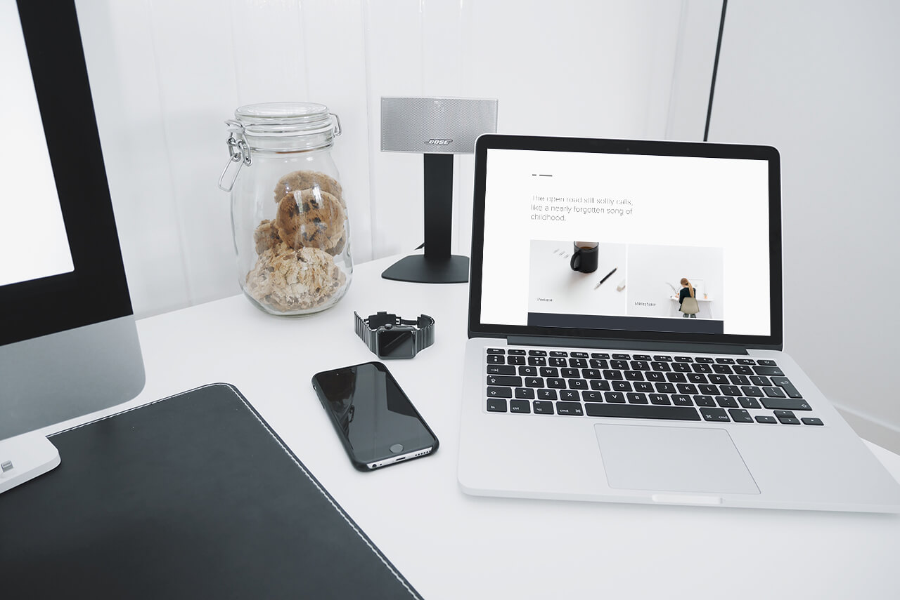

{::nomarkdown}

{:/}

## Work placement thoughts

First and foremost, I am really thankful for the opportunity given to me by Riktig Spor and the University of Winchester for letting me work in Norway while I study. I thoroughly enjoyed working here, and in fact, it doesn't really feel like work just yet – because I am simply having fun doing it. I learn something new every day and I hope I will continue to do so for all my foreseeable future.Read my <a href="/riktigspor">thoughts on working for Riktig Spor</a> for context

From work I learned how to deal with clients and projects. I covered several projects on my own, forcing me to consider every aspect of the task, including cost, design, development, time management and delivery. I believe the <a href="/projects">projects</a> displays a great amount of work, and while I really wanted to show you all the projects I had the pleasure of working on, not all of them were ready for public a release just yet.

I had hopes of improving my my skills in client management, business strategies and the modern web development workflow – and I believe I did, in all of these areas.

I hope to continue working for Riktig Spor in my second semester as well. From there, I'd like to further develop my workflow and pick up better practises for developing maintainable web products. I also want to be more strict on code style-guides to lay a solid foundation for additional developers on the team.

{::nomarkdown}

{:/}

## Workflow reflection

<!-- * Is it optimal
* Skills obtained, currently efficient in the following: PHP, Git etc. -->

My workflow is not optimal just yet, and I'm still learning new things every day. However, I believe this works right now, while I am still the only developer on the team. Along the way I obtained new skills, primarily with client and server management.

The term "front-end developer" is very broad – it ranges from simple HTML and CSS to complex JavaScript frameworks – and even to people who write said frameworks. This was discussed in a recent <a href="http://shoptalkshow.com/episodes/193-the-state-of-front-end-dev-ala-rebroadcast/" target="_blank">ShopTalk episode</a>, and based on that I still identify as a front-end developer. That is to say, I feel proficient in the following technologies and languages – to name a few:

<ul class="skill-list">
	<li>HTML</li>
	<li>HTML preprocessors</li>
	<li>CSS</li>
	<li>CSS preprocessors</li>
	<li>CSS frameworks</li>
	<li>JavaScript</li>
	<li>JavaScript frameworks</li>
	<li>Markdown</li>
	<li>YAML data in Jekyll</li>
	<li>Liquid templating</li>
	<li>Git and version-control</li>
	<li>Build tools (Gulp)</li>
	<li>Static site generators</li>
	<li>Content management systems (Wordpress)</li>
	<li>PHP</li>
	<li>Server- and domain configurations</li>
	<li>SSH and safe uploading</li>
	<li>SEO and social media integration</li>
	<li>Web performance</li>
	<li>Web accessibility</li>
</ul>

Also, software to manage all of this:

<ul class="skill-list">
	<li>Photoshop</li>
	<li>Illustrator</li>
	<li>InDesign</li>
	<li>Lightroom</li>
	<li>Final Cut Pro</li>
	<li>Sublime Text or other text-editors with Emmet</li>
	<li>MAMP</li>
	<li>Terminal (command line)</li>
</ul>

## Secondary work

My side projects are usually initiated by boredom or lacking challenges. This has not been the case since I started working full-time and therefore the majority of my sideprojects have been put on hold for now.

There are obviously reasons to work on side-projects, and I do in fact encourage it. My motivation used to be a richer portfolio, but after landing a job I enjoy, my personal portfolio has not been of high priority. I am sure my lecturers and professors can relate to this. Even people lecturing me on the importance of portfolio can not find the time to update their own after landing a job they like.

I feel this is justified, but I do intend to pick up more side-projects and update my personal public portfolio as I finish university, and have my evenings and afternoons free.

{::nomarkdown}

{:/}

## Portfolio reflections

The purpose of this website is to show my work in a reflective manner, and I believe I achieved that goal by assigning work to different categories. I avoided bloat by having separate sections for development/processes, reflections and final outcomes.

The portfolio is based upon tutor feedback from my previous semester, which in return was based on feedback from the semester before that. This should show adaptation to critique and should, in theory, offer a better user experience than the last.

My site was developed from scratch, which in itself should demonstrate my abilities. The projects are laid out in a clean and organised fashion for ease-of-use and satisfy the assessment sheet on the topic of breadth and depth. The code is also commented, which is a case-study in itself.

Possible improvements include the serving of different image-resolutions based on the device and/or connection quality, critical CSS loading and aggressive content-caching.

Given the timeframe and purpose of the site, I am very happy with the outcome, and believe the improvements mentioned to be important, but of low priority.

## Final thoughts

I want to address the work/uni arrangement, what I hope to do in the future and whether I am happy with the final outcome or not.

As stated, I am very happy to be able to work while I study and I appreciate the trust from the university and opportunity from Riktig Spor. I am eager to start my career in web development, and this has certainly given me a good start. The feeling of seeing something you made being used by real people is very heartwarming.

For my second semester, which is not intended for work placement as a module, I may have to follow a strict one-on-one tutorial schedule to make sure I am not falling behind. Looking back, I am very pleased with my decision of working full-time and the uni/work arrangement agreed upon.

I am also very pleased with the outcome of all my projects this semester – at university and at work. I do, however, hope to improve in both fields over the next semester, and offer my best portfolio yet in May 2016.

