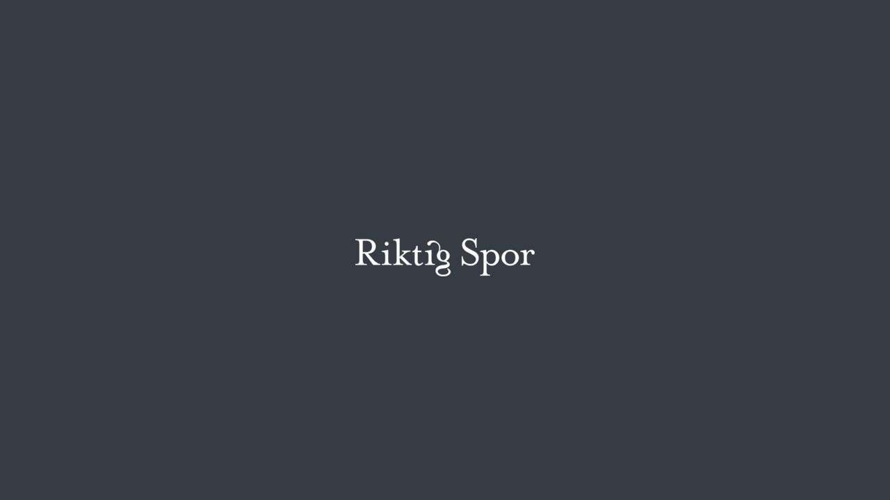
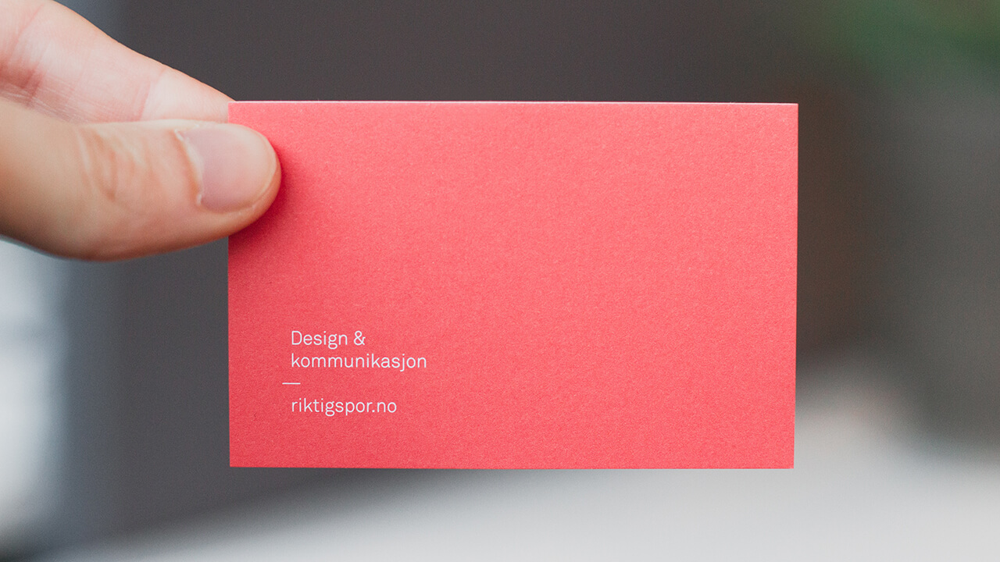
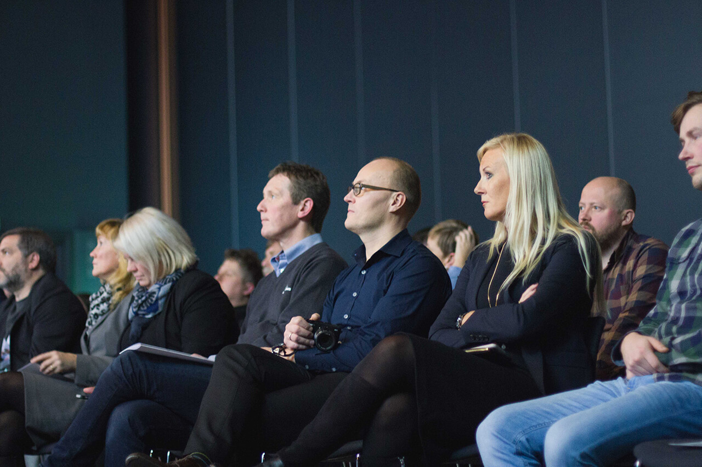

{::nomarkdown}

{:/}

For the past four months I have been working as a designer and web developer at Riktig Spor in Bodø, Norway &mdash; and I hope to continue working here for my next semester. I work five days a week, covering a range of clients &mdash; from small websites to larger corporate ones. This article aims to cover the majority of these, but leaves out a few for contract reasons.See all the <a href="/projects">projects</a> I contributed to

As a general preface to this section, I should mention my responsibilities. I am admittedly still a student, and with that I am still learning &mdash; which is also the ultimate goal of this work placement. However, I am the primary web developer at this company, and thus I quickly took on the responsibility of hosting, developing and designing websites and web applications. I also cover photography at times, and the role of the web advisor for clients.

See all the <a href="/projects">projects</a> I contributed to.

## The experience

I quickly had to widen my comfort zone in order to work efficiently. While I am comfortable developing relatively static sites, dynamic and editable content is a new world to me. Necessary to meet client needs, certainly, but undiscovered lands to me nonetheless.

The current plan of action is to expand our web horizon, where I play a key role. I hope I can continue to improve in order to make us the very best at this in Northern Norway.

{::nomarkdown}

{:/}

## Words from the general manager

Lorem ipsum dolor sit amet, consectetur adipisicing elit. Enim iusto possimus, consectetur ipsam deserunt voluptatibus maiores necessitatibus exercitationem doloribus architecto vitae quo voluptatem nulla tenetur consequatur id fugiat, sequi laudantium nostrum debitis hic veritatis, ipsa a! Suscipit beatae tenetur odio facilis, libero ad vitae labore perspiciatis expedita error dolor blanditiis?

Lorem ipsum dolor sit amet, consectetur adipisicing elit. Incidunt et deleniti, amet perferendis, eaque temporibus officia tenetur quidem ducimus provident perspiciatis assumenda repellendus accusantium neque sint accusamus eos pariatur inventore.

{::nomarkdown}

{:/}

<blockquote>
	
Sitat

	
Jofrid, Senior Communication Advisor

</blockquote>

<!-- <blockquote>
	
Sitat

	
Svein, Senior Graphic Designer

</blockquote> -->

<!-- <blockquote>
	
It has been great to have Magnus at Riktig Spor, as he brings a unique set of skills. He is a fast worker, and solves any given task well. 

	
Cathrine, Senior Graphic Designer

</blockquote> -->

<blockquote>
	
Magnus is talented and professional &mdash; it's always a pleasure to ask him for help in Wordpress.

	
Marita, Senior Graphic Designer

</blockquote>

<blockquote>
	
Working with Magnus is a great pleasure. He is accurate, eloquent and efficient. He brings to us much needed technical know-how. Magnus is also a nice guy, and despite his somewhat freakish lunch habits, he fits in at Riktig Spor.

	<!-- Orginal -->
	<!-- 
Working with Magnus is a great pleasure. He is accurate, eloquent and efficient. He brings to us much needed technical know-how. Magnus is also a nice guy. He is clean, well behaved and, despite his some what freekish lunch habits, fits in at Riktig Spor.
 -->
	
Fredric, Project Manager

</blockquote>

<!-- <blockquote>
	
Sitat.

	
Anne Marie, Design Apprentice

</blockquote> -->

{::nomarkdown}

{:/}

## Reflection & conclusion

Looking back at the <a href="/projects">projects</a> I contributed to, I am privileged, proud and humbled to be a part of this company. As the lone developer in a team of mainly designers, I feel valuable – which is incredibly heartwarming, as web development has been a passion for years now. Sure, I am still learning new things, but it is relieving to have all those late nights learning JavaScript and CSS pay off.

The experience of working here so far has been great, and while I certainly do make mistakes on a regular basis, I learn from it and adapt – and they let me, which I believe is beneficial for both parties.

I have experienced great launch-events and undertaken small, medium and large-scale websites. I also had to explore the server-side aspect of the web, along with dynamic programming languages like PHP – both of which being fairly new to me. I hope to become more confident as time passes, but I will hopefully never slow down or stop learning new things.

See all my <a href="/projects">projects</a> for Riktig Spor.

<!-- * Lofoten Links
* Riktig Spor web
* Opplyst
* MKK
* Bryggerikvartalet
* Bodø Havn
* Riktig Spor template, concept development
* Glea
* Bodø i Vinden
* Bodø 2016 - photography
* General photography -->

