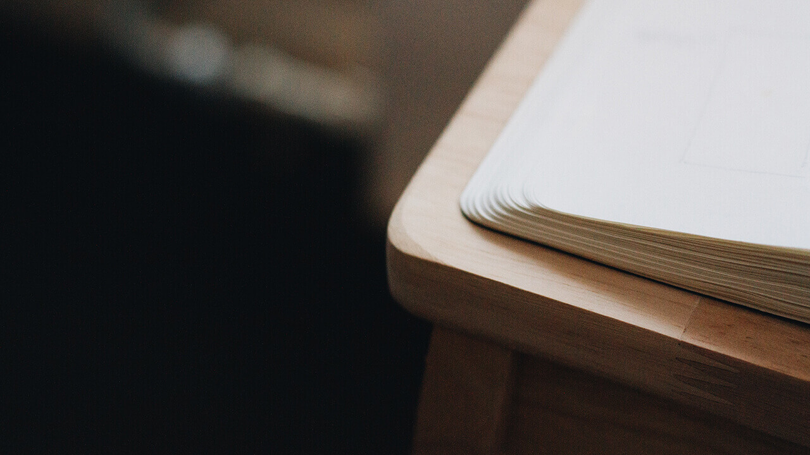
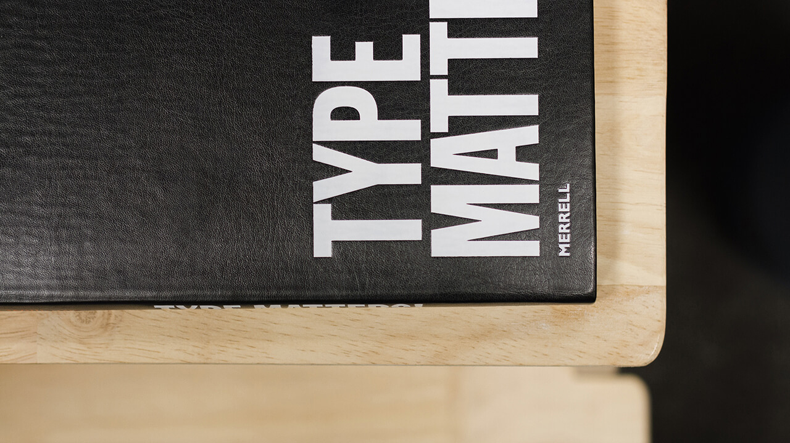

{::nomarkdown}

{:/}

To make this semester work, having the right priorities at the right time has been crucial. The majority of my time is spent working as a designer and web developer, pushing university assignments, research and deadlines to the afternoons and weekends. This worked surprisingly well in my opinion, and I could seamlessly tune in for important lectures over Skype – even at work.Working five days a week, I had to use Skype to attend lectures across the ocean

Similarly to my previous semester, I follow a priority-list. The dissertation-module alone proposes 222 student-managed learning hours. With an additional 64 hours suggested for my portfolio workshop module, proper planning was essential. This was elevated by the fact that I didn't have students stressing out about deadlines around me – and thus peer pressure to do work was merely nonexistent. A strange experience, sure, but certainly affected my stress-levels mentally.

## Average week

Mondays:

<ul class="skill-list">
	<li>Work</li>
	<li>Traffic meeting to outline the coming week</li>
	<li>Review of the previous week</li>
	<li>Design chat and design inspiration</li>
	<li>List hours at the end of each day to keep track of completed work</li>
</ul>

Tuesday:

<ul class="skill-list">
	<li>Work</li>
	<li>Listing hours</li>
	<li>University work</li>
</ul>

Wednesdays:

<ul class="skill-list">
	<li>Work</li>
	<li>Listing hours</li>
	<li>University work</li>
	<li>Preperation for lectures</li>
</ul>

Thursdays:

<ul class="skill-list">
	<li>Work</li>
	<li>Listing hours</li>
	<li>University work</li>
	<li>Lecture over Skype</li>
	<li>University assignments (evening)</li>
</ul>

Fridays:

<ul class="skill-list">
	<li>Work</li>
	<li>Listing hours</li>
	<li>Reflect over the week and take some notes for the notebook</li>
	<li>Rough plan for next week</li>
</ul>

Weekends:

<ul class="skill-list">
	<li>Catch up if I'm behind on work</li>
	<li>Catch up if I'm behind on university work</li>
	<li>Relax if I'm on track</li>
</ul>

## Work hours

I track my hours at work through the XS Office web application. It's in Norwegian, but the words to look out for are "ekstern" and "intern", which is external work (for clients) and internal work (for the company itself or anything not related to a client). They simply refer to something like a client website for external work, or our own website for internal work.

Other keywords to look out for would be "møte", which is referring to meetings (external and internal), and "kompetanseheving", which is usually referring to lectures or dedicated university hours. My average week is just below 40 hours, but the occasional important deadline can definitely push this higher – like week 43, which was just above 70 hours.

<a href="../img/workflow/hours.zip">Download my work hours</a>

{::nomarkdown}

{:/}

## How I work

This has not changed much from my previous semester either, and the process is still very organic. The <a href="http://magnusskare.science/sketchbook/" target="_blank">articles I wrote on sketching</a> still applies to my workflow, but the process is now heavier on client feedback and understanding their needs. I still capture the majority of my thoughts in the form of text, lists or mind-maps – which is working quite well for me as I can still focus on what the client is actually saying. You can gather a brief overview of how I sketch out my thoughts in the <a id="scroll" href="#video">sketchbook video</a>.

I specialise in front-end development, and thus I'd assume my workflow should be of interest. We usually start off with request and/or brief, which is countered by a offer and price estimate. This defines the project, whether we are selling design or merely the functionality of a website – this is crucial to the next step.

If the client requested web-design as a part of the brief, I design according to the brief – usually from some rough sketches, existing brand material and/or buleltpoints to a PSD mockup with a complementary moodboard/presentation. This is to give the client something visual to grasp, as vague (or even well thought out) explainations rarely come across. If the client is simply looking for a website with little to no care for any particular design, we could set up a existing theme for them and populate it with their content and message.

## Development

I develop my sites locally with <a href="https://wordpress.org/" target="_blank">Wordpress</a> and <a href="https://www.mamp.info/en/" target="_blank">MAMP</a> or <a href="http://jekyllrb.com/" target="_blank">Jekyll</a> – depending on the purpose and scale of the website. Jekyll works well for relatively static websites, and Wordpress is our CMS of choice when the client(s) would like to update the site themselves post-launch. I develop smaller sites from my <a href="https://github.com/partcoffee/snap" target="_blank">personal boilerplate</a>, which I have adapted to Wordpress-development as well – it's very similar, but the grid-system has since been replaced with the modern CSS flexbox property for layouts.

I have moved on from <a href="http://gruntjs.com/" target="_blank">Grunt</a> to <a href="http://gulpjs.com/" target="_blank">Gulp</a> as my build-system of choice to handle assets. This compresses all my images and vector graphics, processes Sass, minifies and concatenates JavaScript and CSS files, before finally pushing everything to a distribution-folder. The system will also automatically reload and synchronize scrolling across every browser/device on the samme network through BrowserSync – which allows for effecient user-testing and debugging.With BrowserSync, I can navigate and scroll my site on my Mac, and connected devices will follow the scroll-position and clicks with next to no delay.

I use <a href="webpagetest.org" target="_blank">WebPagetest</a> to catch performance-bottlenecks and analyse web performance from anywhere across the globe. I also run the site through <a href="https://developers.google.com/speed/pagespeed/insights/" target="_blank">PageSpeed Insights by Google</a> to check mobile performance and whether WebPagetest missed anything.

The site will usually be tested with several SEO-testers to check for best practises and anti-patterns. This is usually while I test the social features of the site, which is run through Facebook's <a href="https://developers.facebook.com/tools/debug/og/object/" target="_blank">Open Graph Object Debugger</a>. Feel free to test this site through any of these tools for yourself.

Finally, I export and import the database (if it's Wordpress), SSH or SFTP (for security reasons) the site to the live server, and update broken links (if it's Wordpress, as Wordpress uses absolute URL-paths).

I use Git for my personal projects, but at work I am the only developer, and thus collaboration (which is the main feature of version-control) is not as important to me. I will definitely encourage the use of Bitbucket or GitHub along the way though.

	<iframe src="https://player.vimeo.com/video/86443370?color=fff&amp;title=0&amp;byline=0&amp;portrait=0" width="1280" height="720" frameborder="0" webkitallowfullscreen mozallowfullscreen allowfullscreen></iframe> 
<a href="https://vimeo.com/86443370">Concept Someone [Showcase]</a> from <a href="https://vimeo.com/saphiralol">Magnus Skare</a> on <a href="https://vimeo.com">Vimeo</a>.

HER KOMMER DET VIDEO. SKRIV SEKUND I ARTIKKELAN, ALTSÅ "SE SEKUND X FOR SKETCHES"

## Sketchbook

As I couldn't physically submit my sketchbook, I had to submit it digitally. And as I had no time to scan my entire sketchbook, I made a short video. The notes are unfortunately in Norwegian, but you are free to pause wherever you want. HD is available on Vimeo.com, as embded HD videos requires a Pro version.

## Inspiration and design research

<!-- The answer "it depends" is very common in the web development business, as it all depends on client needs and requirements. A fair amount of clients are simply looking for a presence online, and for that a Wordpress theme will suit them just fine. Thus, I'm afraid I can't talk about any particular clients  -->
While each client project is unique in terms of what kind of research we do, I can give you a general idea of where I find inspiring things and what influences my projects the most.

The web is famously claimed to be mostly typography, and I find a large amount of inspiration from physical magazines and books. <a href="http://monocle.com/magazine/" target="_blank">Monocle</a>, <a href="http://www.offscreenmag.com" target="_blank">Offscreen</a> and the printed version of <a href="http://www.aftenposten.no/amagasinet/" target="_blank">Aftenposten's A-magasinet</a>, just to name a few, are all outstanding approaches to layout and typography in my opinion. I also picked up a copy of Type Matters by Jim Williams – the book is a few years old now (2012), but still very useful and relevant as a reference-piece today. I appreciate the simplicity of a visual hierarchy based solely on typography and photography in magazines and newspapers, and often aim to translate this to the responsive and fluid web.

{::nomarkdown}

{:/}

I'm also inspired by people greater than me, and I often aim to be the least experienced person in the room – as cheesy as that may sound. I enjoy Scandinavian design, but also the work from outstanding individuals like Erik Spiekermann, Dieter Rams and Andrew Kim.

I also think it's important to look outside the design industry for inspiration. Tobias van Schneider wrote a <a href="https://medium.com/@vanschneider/the-day-you-became-a-better-designer-68ee48e1c34c#.mk7lh663v" target="_blank">great article</a> on the topic, which essentially encourages us to not be trapped inside our comfort-zone. I can echo this statement, especially in logo design.

{::nomarkdown}

{:/}

Web design inspires web design, and I obviously find inspiration through the Internet. These are a few of my favourite sites for inspiration, along with a variey of Tumblr-blogs, Twitter people, Instagram accounts, design blogs and other websites:

<ul class="skill-list">
	<li><a href="http://squarespace.com/" target="_blank">Squarespace</a></li>
	<li><a href="https://dribbble.com/" target="_blank">Dribbble</a></li>
	<li><a href="http://www.siteinspire.com/" target="_blank">Siteinspire</a></li>
	<li><a href="http://mindsparklemag.com/?websites" target="_blank">MindSparkle Magazine</a></li>
	<li><a href="http://www.awwwards.com/" target="_blank">Awwwards</a></li>
	<li><a href="http://fontsinuse.com/" target="_blank">Fonts In use</a></li>
	<li><a href="http://designspiration.net/" target="_blank">Designspiration</a></li>
	<li><a href="http://codepen.io/" target="_blank">Codepen</a></li>
</ul>

I appreciate a minimal approach to things. We make things too complicated, and I believe simplcity is often ignored in favour of flashy features. Simplacity can also be translated into code. Code excellence isn't when there's nothing more we can add, but when there's nothing more we can take away. Ship honest and good products, make them maintainable and don't take shortcuts. These are high demands when the deadline is approaching, but I believe it is worth considering – at every step along the way.

## Reflection & conclusion

My workflow is currently somewhat dictated by company deadlines, but it's still very organic – from idea to final product, with feedback and critique along the way. I do believe the ability to adapt to a team and their routines to be crucial for employability, but at the same time I think it is important to add something of your own as well. For us, that was a modern web development workflow.

In terms of time management, Riktig Spor has been very flexible and understanding, giving me as much time as needed to attend lectures, develop this portfolio, work on my dissertation proposal and professional portfolio.

I believe the web development process will become more streamlined the longer I work here, as I do trip and stumble along the way. But I am still a student, and by the end of my second semester I should experience far fewer hiccups – which is a journey I am looking forward to.

